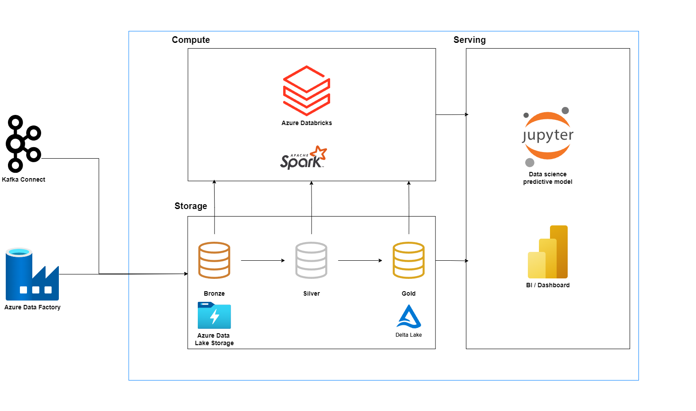

# Fitness Data Streaming Pipeline

## Overview

The **Fitness Data Streaming Pipeline** is a real-time data processing system built on Databricks. The pipeline is designed to handle fitness-related data such as user registrations, gym logins, workouts, and heart rate data. It ingests, processes, and stores data using a structured multi-layer architecture, ensuring that data is reliable, up-to-date, and ready for analysis.

## Data Flow
The pipeline architecture is divided into three layers: **Bronze**, **Silver**, and **Gold**. These layers process the data step-by-step to clean, enrich, and aggregate it for downstream analysis and reporting.

1. **Bronze Layer**: 
   - This layer ingests raw data from various sources (e.g., user registrations, gym logs, workout events, and heart rate data). 
   - Data is stored as-is for logging purposes and to ensure data lineage.
   - Table examples: `registered_users_bz`, `gym_logins_bz`, `workouts_bz`, `heart_rate_bz`.

2. **Silver Layer**:
   - The Silver layer transforms the raw data, removing duplicates and enriching it by joining with relevant datasets (e.g., user profile data). 
   - This layer ensures data consistency and prepares it for business-level queries.
   - Table examples: `users`, `gym_logs`, `completed_workouts`, `user_profile`.

3. **Gold Layer**:
   - The final aggregation happens in the Gold layer, where the processed data is summarized for reporting and analytical use cases.
   - This layer generates key metrics such as workout summaries and heart rate analysis.
   - Table examples: `workout_bpm_summary`, `gym_summary`.

## Features

- **Real-time Data Ingestion**: The pipeline leverages Databricks' streaming capabilities to process incoming data in real-time.
- **Scalable Architecture**: Using Databricks and Delta Lake, the pipeline ensures scalability and efficient data storage.
- **Multi-layer Transformation**: Data passes through Bronze, Silver, and Gold layers for incremental transformation, ensuring high data quality and consistency.
- **Fault Tolerance**: Built-in checkpoints and retries guarantee data reliability even in the case of system failures.
- **Aggregation and Analytics**: Data is enriched and aggregated to generate insights such as user workout trends and heart rate statistics.

## Project Structure

- **01-config.py**: Contains project-level configurations like paths for data and checkpoints.
- **02-setup.py**: Initializes and sets up necessary databases and tables in the Bronze, Silver, and Gold layers.
- **03-history-loader.py**: Loads historical data into the pipeline for validation and testing.
- **04-bronze.py**: Processes raw data streams into the Bronze layer tables.
- **05-silver.py**: Processes Bronze layer data and upserts it into Silver layer tables.
- **06-gold.py**: Aggregates data from Silver tables to generate Gold layer summaries.
- **07-run.py**: Orchestrates the entire pipeline and runs it in either batch or stream mode.
- **08-produce.py**: Producing and generating test data into the raw data landing zone to simulate real-time data ingestion

## Running the Project

1. **Stream Mode**:
   - Set `RunType` to `stream` in the `07-run.py` script.
   - Trigger the pipeline to continuously process incoming data streams.

2. **Batch Mode**:
   - Set `RunType` to `once` for batch processing of historical data.

## Conclusion

The **Fitness Data Streaming Pipeline** is a comprehensive system that enables real-time data processing for fitness-related datasets. By leveraging the layered architecture, the pipeline ensures that data is processed efficiently and is available for immediate analysis.